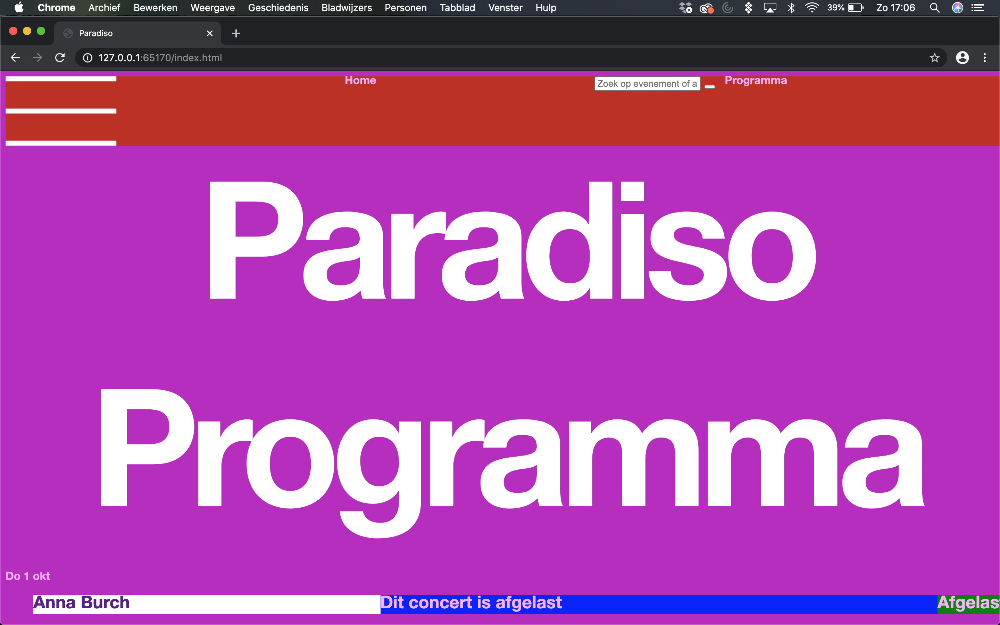
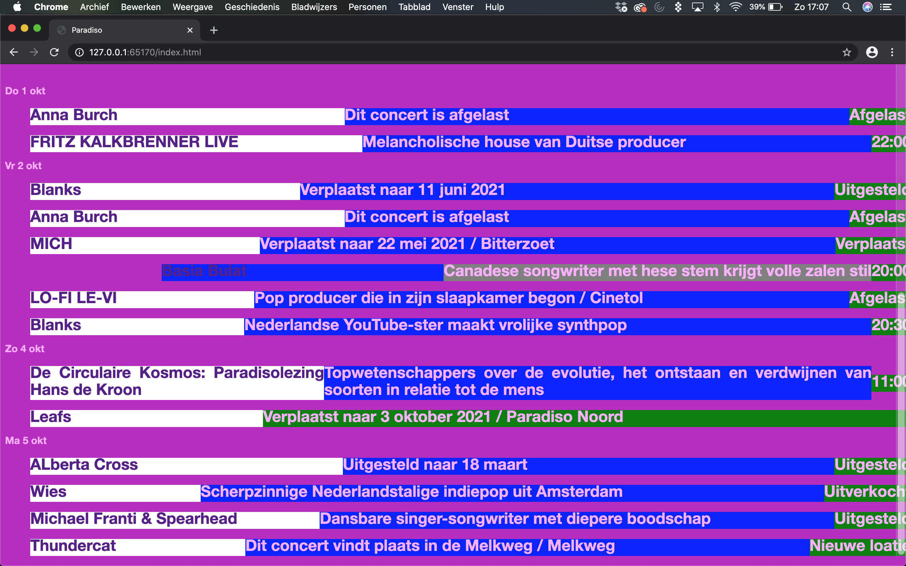
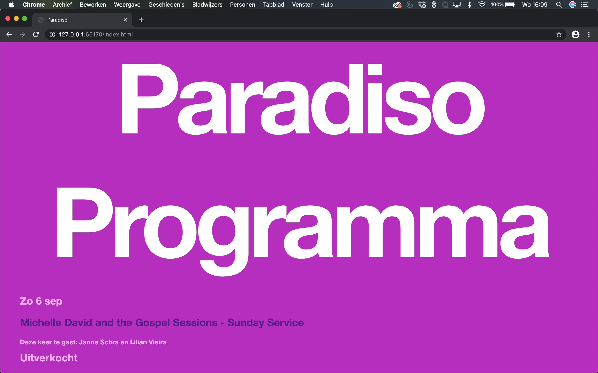
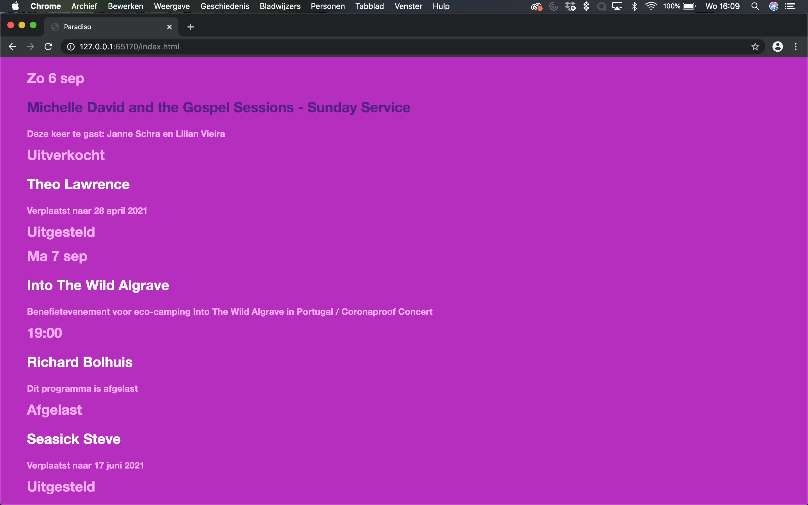
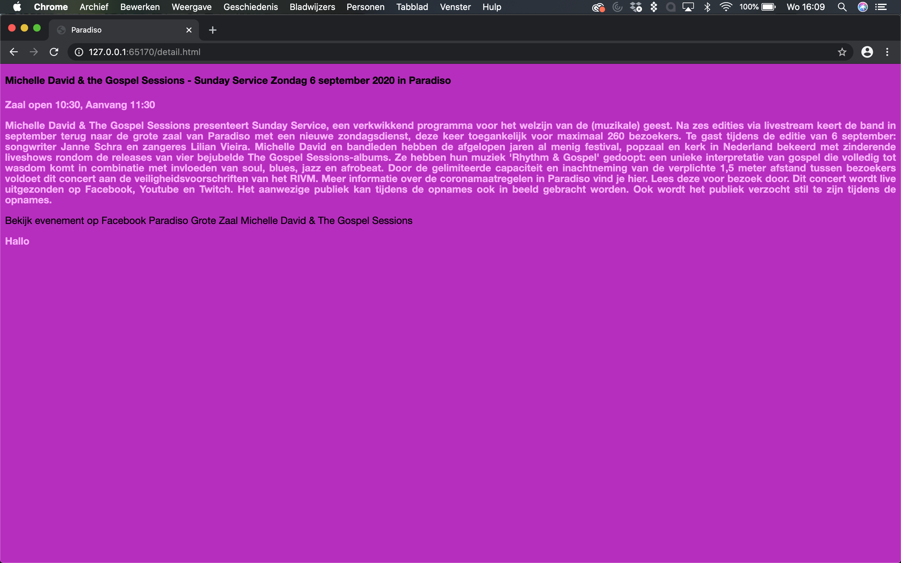

# Procesverslag
**Auteur:** -Lisa Marsman-

Markdown cheat cheet: [Hulp bij het schrijven van Markdown](https://github.com/adam-p/markdown-here/wiki/Markdown-Cheatsheet). Nb. de standaardstructuur en de spartaanse opmaak zijn helemaal prima. Het gaat om de inhoud van je procesverslag. Besteedt de tijd voor pracht en praal aan je website.

## Bronnenlijst
1. -https://www.paradiso.nl/nl/-
2. -https://www.youtube.com/watch?v=68O6eOGAGqA-
3. -https://www.youtube.com/watch?v=6yAAV-uP0po-
4. -https://stackoverflow.com/questions/38748263/how-to-combine-flexbox-order-and-nth-childodd-
5. -https://stackoverflow.com/questions/55225342/flexbox-columns-in-ascending-order-
6. -https://stackoverflow.com/questions/54921884/flexbox-nav-bar-toggle-
7. -https://medium.com/cloud-native-the-gathering/how-to-use-css-to-fade-in-and-fade-out-html-text-and-pictures-f45c11364f08-
8. -https://codepen.io/shooft/pen/wvGyvRQ-
9. -https://stackoverflow.com/questions/48696594/what-does-it-mean-to-iterate-until-it-reaches-button-length-in-javascript-
10. -https://stackoverflow.com/questions/3331353/transitions-on-the-css-display-property-
11. -https://www.sitepoint.com/community/t/looping-through-li-elements-in-ul/6049-
12. -https://home.hccnet.nl/s.f.boukes/html-5/html-510.htm-
13. -https://support.google.com/youtube/answer/171780?hl=nl-
14. -https://codepen.io/shooft/pen/vYGZqYV-
15. -https://stackoverflow.com/questions/14634595/center-h1-over-image-in-a-div-

## Eindgesprek (week 7/8)

-Tijdens de eindsprint heb ik veel gezocht op het internet. Ik had een goed idee over wat ik wilde laten lukken. Met javascript heb ik nog steeds moeite, maar ik ben tevreden over het eindresultaat. Zonder google, Eyob, Coen en Danny had ik de site er nooit zo uit kunnen laten zien. Ik heb veel geleerd tijdens FeD en ben enthousiaster geworden over coderen.

-Positioneren h1 over afbeeldingen:
https://stackoverflow.com/questions/14634595/center-h1-over-image-in-a-div
https://codepen.io/shooft/pen/vYGZqYV

Filmpjes plaatsen in een html pagina:
https://support.google.com/youtube/answer/171780?hl=nl

Button styling:
https://home.hccnet.nl/s.f.boukes/html-5/html-510.htm

for loop:
https://www.sitepoint.com/community/t/looping-through-li-elements-in-ul/6049
https://stackoverflow.com/questions/3331353/transitions-on-the-css-display-property
https://stackoverflow.com/questions/48696594/what-does-it-mean-to-iterate-until-it-reaches-button-length-in-javascript

button animatie:
https://codepen.io/shooft/pen/wvGyvRQ
https://medium.com/cloud-native-the-gathering/how-to-use-css-to-fade-in-and-fade-out-html-text-and-pictures-f45c11364f08

-

**Screenshot(s):**

-

-

## Voortgang 5 (week 6)

-Deze week is de navigatie bar eindelijk gelukt om vorm te geven met flexbox met behulp van stackoverflow. De volgende bronnen waren zeer nuttig:
https://stackoverflow.com/questions/54921884/flexbox-nav-bar-toggle
https://stackoverflow.com/questions/55225342/flexbox-columns-in-ascending-order
https://stackoverflow.com/questions/38748263/how-to-combine-flexbox-order-and-nth-childodd

Ook is het mij gelukt om de afbeeldingen op de homepage vorm te geven met GRID. De volgende bronnen hebben mij hierbij geholpen:
https://www.youtube.com/watch?v=6yAAV-uP0po
https://www.youtube.com/watch?v=68O6eOGAGqA

-

-

-

## Voortgang 4 (week 5)

-Deze week liep ik erg vast met mijn website, vandaar dat er geen visuele verandering is in mijn website. Ik heb met name lang gedaan over de oefeningen met GRID op DLO. Lisa Roelvink en ik zitten een beetje in hetzelfde schuitje qua herkansingen. Daarom hebben wij samen op de HvA gezeten om te werken aan FeD. Dit is een goede keuze geweest, aangezien ik het deze week prive moeilijk had. Ook heb ik de website stackoverflow herontdekt door een vriendin van mij die veel bezig is met Artificial Intellegence. -

## Voortgang 3 (week 4)

-Deze week heb ik mij gefocust op mijn eindopdracht, de website van Paradiso nabouwen. Ik ben een eind verder gekomen met het gebruiken van flexbox op de lijsten waarin het programma staat. Verder heb ik mijn kennis in Grid deze week verbreed. Dit ga ik volgende week toepassen op mijn website. De foto's op de voorpagina zijn daar geschikt voor.-

-
-

## Voortgang 2 (week 3)

-Deze week ging het goed met het werken aan de huiswerkopdrachten. Echter ging het wat minder toen mijn kennis tijdens de les op de proef werd gesteld. Ik heb verder gewerkt aan mijn website. Flexbox is toch moeilijker dan gedacht. Ik heb daarom hulp ingeschakeld van een studiegenoot/vriend die mij in week 3 bijles zal geven.-

**Screenshot(s):**

-

-

## Voortgang 1 (week 2)

### Stand van zaken

-Ik had moeite met opstarten. Naarmate ik de vormgeving zag veranderen van mijn website werd ik enthousiaster. Dit ging dus goed. Ik had een enkele frustratie, omdat ik bij de link naar de detailpagina de underline niet weg kreeg. Ik wist dat ik in de css de volgende regel code moest plaatsen: text-decoration: none;. Wat er mis ging is dat ik hem op het verkeerde element had geplaatst.

Ik heb ervoor gekozen om de website voor desktop te ontwerpen, omdat mij dat persoonlijker makkelijker afgaat. De mobiele webpagina van paradiso vind ik namelijk minder mooi dan de desktop versie. Het lijkt mij leuk om me te focussen op de Surface plane. Mijn doel is om de Look & Feel van Paradiso op deze manier goed naar voren te laten komen.-

**Screenshot(s):**

-

-

### Agenda voor meeting

-Als team hadden wij wat vragen over het schalen en responsive krijgen van een website. Echter had ik persoonlijk meer de vraag over hoe ik elementen in mijn nav bar goed kan positioneren.-

### Verslag van meeting

-Danny heeft mij een aantal globale tips gegeven wat betreft het positioneren van elementen in een navigatie. Echter heb ik vooral gebruik gemaakt van flexbox om mijn navigatie goed te positioneren.-

## Intake (week 1)

**Je startniveau:** -blauwe piste-

**Je focus:** -surface plane-

**Je opdracht:** -https://www.paradiso.nl/nl/
Deze website heb ik gekozen, omdat ik denk dat de breakpoints op de website nog niet optimaal benut zijn. Dit lijkt mij interessant om aan te passen. Echter ben ik meer geinteresseerd in het maken van een toffe animatie op de homepage. Ik vind de site namelijk niet erg interactief, omdat er alleen een lijst is met het programma van Paradiso.-

**Screenshot(s):**

**Breakdown-schets(en):**

