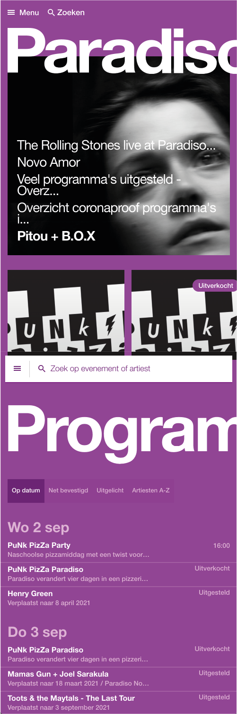
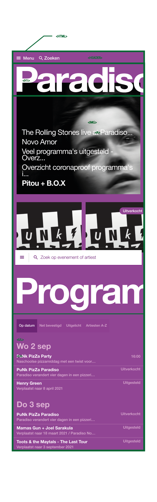

# Procesverslag
**Auteur:** -Lisa Marsman-

Markdown cheat cheet: [Hulp bij het schrijven van Markdown](https://github.com/adam-p/markdown-here/wiki/Markdown-Cheatsheet). Nb. de standaardstructuur en de spartaanse opmaak zijn helemaal prima. Het gaat om de inhoud van je procesverslag. Besteedt de tijd voor pracht en praal aan je website.

## Bronnenlijst
1. -bron 1-
2. -bron 2-
3. -...-

## Eindgesprek (week 7/8)

-dit ging goed & dit was lastig-

**Screenshot(s):**

-screenshot(s) van je eindresultaat-

## Voortgang 3 (week 6)

-same as voortgang 1-

## Voortgang 2 (week 5)

-same as voortgang 1-

## Voortgang 1 (week 3)

### Stand van zaken

-Ik had moeite met opstarten. Naarmate ik de vormgeving zag veranderen van mijn website werd ik enthousiaster. Dit ging dus goed. Ik had een enkele frustratie, omdat ik bij de link naar de detailpagina de underline niet weg kreeg. Ik wist dat ik in de css de volgende regel code moest plaatsen: text-decoration: none;. Wat er mis ging is dat ik hem op het verkeerde element had geplaatst.

Ik heb ervoor gekozen om de website voor desktop te ontwerpen, omdat mij dat persoonlijker makkelijker afgaat. De mobiele webpagina van paradiso vind ik namelijk minder mooi dan de desktop versie.-

**Screenshot(s):**

-![eerste versie website.][(images/proces_wk1_1.png)]
![eerste versie website.][(images/proceswk1_2.png)]
![eerste versie website.][(images/proceswk1_3.png)]
-

### Agenda voor meeting

-samen met je groepje opstellen-

### Verslag van meeting

-na afloop snel uitkomsten vastleggen-

## Intake (week 1)

**Je startniveau:** -blauwe piste-

**Je focus:** -surface plane-

**Je opdracht:** -https://www.paradiso.nl/nl/
Deze website heb ik gekozen, omdat ik denk dat de breakpoints op de website nog niet optimaal benut zijn. Dit lijkt mij interessant om aan te passen. Echter ben ik meer geinteresseerd in het maken van een toffe animatie op de homepage. Ik vind de site namelijk niet erg interactief, omdat er alleen een lijst is met het programma van Paradiso.-

**Screenshot(s):**

**Breakdown-schets(en):**

